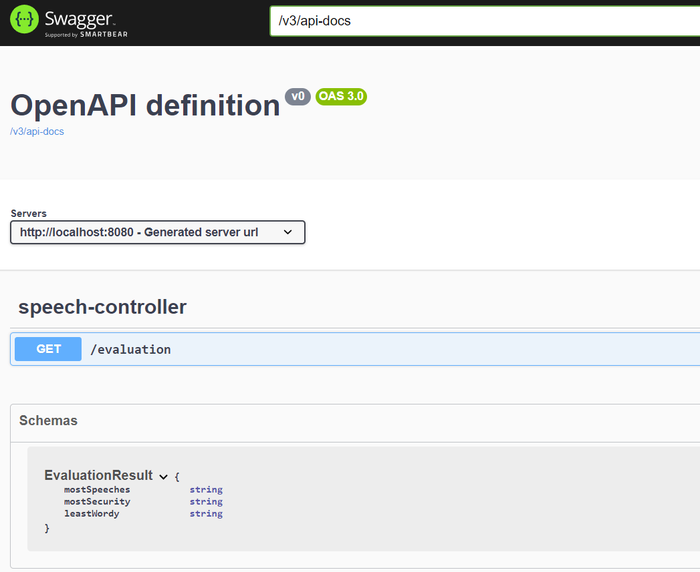
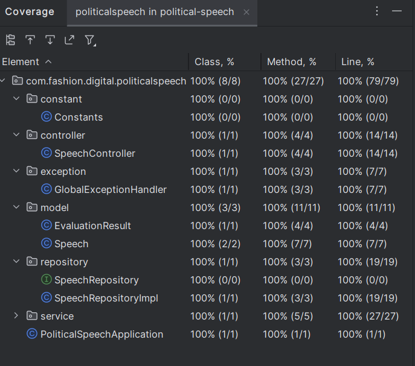

### Political Speech Application

This application runs on port 8080 by default. You can change the port by passing the `--server.port` argument to the application.

The application exposes one endpoint:
`/evaluation?url1={url1}&url2={url2}`. It returns a json body of statistics for the given urls such as:
After calculating statistics, If the result is the same then it will return the first one.

```
{
    "mostSpeeches": "Alexander Abel",
    "mostSecurity": "Alexander Abel",
    "leastWordy": "Mixan Abel"
}
```

### Architecture
The application is built on top of Spring Boot and uses Java 17, Lombok.

### Storage
The application uses in-memory list based.
This provides extremely fast way to store and retrieve data.

For calculating statistics collections(map) and stream are being used.

### Running the app
Once the server is running you can check the results via postman or any other rest client at
```http://localhost:8080/evaluation?url1=https://raw.githubusercontent.com/atesibrahim/csv-files/main/file1.csv&url2=https://raw.githubusercontent.com/atesibrahim/csv-files/main/file2.csv```

you can use the following curl command:
```curl --location --request GET 'http://localhost:8080/evaluation?url1=https://raw.githubusercontent.com/atesibrahim/csv-files/main/file1.csv&url2=https://raw.githubusercontent.com/atesibrahim/csv-files/main/file2.csv'```

or you can see swagger openapi page at:
```http://localhost:8080/swagger-ui.html```




For example after you hit the endpoint with given urls mentioned above response will look like the following for the URLs you provided:
```
{
    "mostSpeeches": "Alexander Abel",
    "mostSecurity": "Alexander Abel",
    "leastWordy": "Mixan Abel"
}
```

### Running the tests
To run the tests you can use the following maven commands.
```mvn test```

Test Coverage



